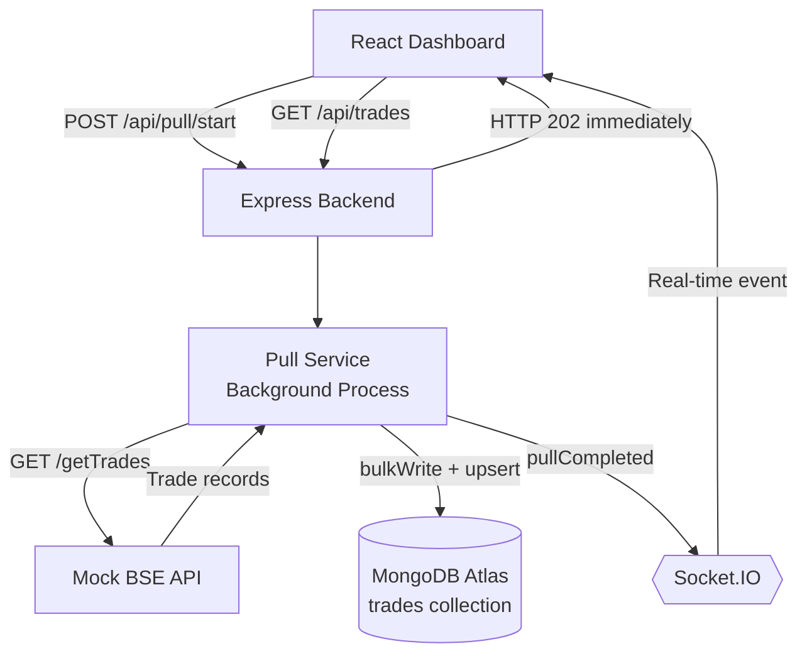
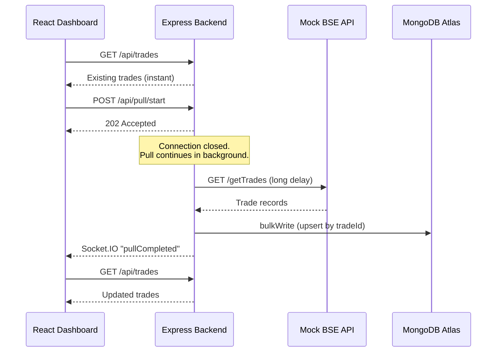

<div align="center">

# 📈 BSE Trades Dashboard

### Real-time trade monitoring that never holds a connection hostage

A full-stack dashboard that pulls thousands of trade records from a BSE Exchange API taking up to **15 minutes**, while staying safely under the network's **30-second HTTP timeout**.

<br/>

[](https://bse-trades-dashboard-1-wwdc.onrender.com)
[](https://bse-trades-dashboard-818z.onrender.com/)
[](#-demo-video)


</div>

---

## 📑 Table of Contents

- [Demo Video](#-demo-video)
- [Live Demo](#-live-demo)
- [Project Overview](#-project-overview)
- [Key Features](#-key-features)
- [Architecture](#%EF%B8%8F-architecture)
- [Why This Architecture?](#-why-this-architecture)
- [Complete Request Flow](#-complete-request-flow)
- [Tech Stack](#%EF%B8%8F-tech-stack)
- [Project Structure](#-project-structure)
- [API Endpoints](#-api-endpoints)
- [Socket.IO Events](#-socketio-events)
- [Database](#%EF%B8%8F-database)
- [Local Setup](#%EF%B8%8F-local-setup)
- [Testing the System](#-testing-the-system)
- [Handling the 30-Second Timeout](#%EF%B8%8F-handling-the-30-second-timeout)
- [Production Considerations](#-production-considerations)
- [Environment Variables](#-environment-variables)
- [Author](#-author)

---

## 🎥 Demo Video

<!-- Paste your demo video link/embed below -->

**Demo Video:** 


https://github.com/user-attachments/assets/7d45b7a8-9c3d-4f1e-aed4-a851fcdcdd38


**The walkthrough covers:**

- ✅ Existing trades displayed immediately
- ✅ Starting a new trade pull
- ✅ Immediate response from the backend
- ✅ Background trade processing
- ✅ Automatic trade updates without page refresh
- ✅ Real-time Socket.IO completion event
- ✅ Increasing trade count after a successful pull

---

## 🌐 Live Demo

| Service | Link |
|---|---|
| 🖥️ **Frontend** (Dashboard) | https://bse-trades-dashboard-1-wwdc.onrender.com |
| ⚙️ **Backend** (API) | https://bse-trades-dashboard-818z.onrender.com |
| ❤️ **Health Check** | https://bse-trades-dashboard-818z.onrender.com/ |

>💡 Hosted on Render's free tier, so the first request may take a few seconds while the service wakes up.

⏱️ Note on the demo delay: The deployed demo and the video use BSE_DELAY_MS=3000 (3 seconds) so the full flow can be seen quickly. The delay is configurable. Set BSE_DELAY_MS=900000 to simulate the real 15-minute BSE pull. The architecture is the same either way, because the browser only waits for the instant 202 Accepted response.

## 📌 Project Overview

This application simulates a system that pulls trade data from a BSE Exchange API.

**The challenge:** a complete pull can take up to **15 minutes**, but the network kills any HTTP connection held open longer than **30 seconds**.

**The approach:** instead of making the browser wait, the backend accepts the request, responds immediately, and finishes the work in the background. When the pull completes, the dashboard is notified over WebSockets and refreshes itself.

---

## ✨ Key Features

| | Feature |
|---|---|
| 🧪 | Mock BSE API with configurable delay |
| 🌱 | Thousands of seeded/generated trade records |
| ⚡ | Immediate `202 Accepted` response |
| 🔄 | Background trade pulling |
| 💾 | MongoDB persistence |
| 🛡️ | Duplicate-safe inserts using `bulkWrite` + `upsert` |
| 📡 | Real-time Socket.IO updates |
| 🚫 | No page refresh, no polling loop, no cron/scheduler |
| 📊 | Pull status tracking and error handling |
| 📱 | Responsive React dashboard |
| 🧩 | Separate frontend and backend services |

---

## 🏗️ Architecture



### Sequence



---

## 💡 Why This Architecture?

### The Problem

```text
BSE pull duration:        up to 15 minutes (900 seconds)
Network connection limit: 30 seconds
```

Keeping a browser request open for the entire pull would be unreliable.

### The Solution

Separate **starting** the pull from **finishing** the pull.

1. The dashboard calls `POST /api/pull/start`.
2. The backend replies `202 Accepted` immediately.
3. The pull continues in the background.
4. Trades are stored in MongoDB.
5. The backend emits a Socket.IO event.
6. Connected dashboards receive it and reload trades automatically.

**This avoids:** long-running HTTP requests, client-side polling, cron-based refreshes, and manual page refreshes.

---

## 🔄 Complete Request Flow

### Step 1 — Dashboard loads

```http
GET /api/trades
```

Already stored trades are displayed immediately.

### Step 2 — User starts a pull

```http
POST /api/pull/start
```

Response (HTTP `202 Accepted`):

```json
{
  "success": true,
  "message": "Trade pull started in background"
}
```

### Step 3 — Background processing

The backend starts the pull without keeping the browser request open. The mock BSE service waits for the configured delay, then generates trade records.

| Mode | Setting | Duration |
|---|---|---|
| Demo | `BSE_DELAY_MS=3000` | ~3 seconds |
| Full simulation | `BSE_DELAY_MS=900000` | 15 minutes |

### Step 4 — Save trades

Trades are stored with `bulkWrite()` and `upsert`, preventing duplicates when a `tradeId` already exists.

### Step 5 — Real-time notification

```js
io.emit("pullCompleted", {
  success: true,
  message: "New trades have been pulled successfully",
  tradeCount: trades.length,
});
```

### Step 6 — Dashboard updates

```js
socket.on("pullCompleted", () => {
  loadTrades();
});
```

**No page refresh required.**

<details>
<summary><b>💻 Key implementation snippets</b></summary>

<br/>

**Immediate API response**

```js
return res.status(202).json({
  success: true,
  message: result.message,
});
```

**Background processing**

```js
setImmediate(async () => {
  try {
    const trades = await fetchTradesFromBSE();

    await Trade.bulkWrite(
      trades.map((trade) => ({
        updateOne: {
          filter: { tradeId: trade.tradeId },
          update: { $set: trade },
          upsert: true,
        },
      }))
    );

    // Pull completed
  } catch (error) {
    // Handle failure
  }
});
```

**Frontend real-time listener**

```js
socket.on("pullCompleted", (data) => {
  setStatus("completed");
  setMessage(data.message);

  loadTrades();
});
```

</details>

---

## 🛠️ Tech Stack

### Frontend


### Backend


### Database


### Deployment & Tools


---

## 📁 Project Structure

```text
bse-trades-dashboard/
│
├── backend/
│   ├── src/
│   │   ├── config/
│   │   │   └── db.js
│   │   ├── controllers/
│   │   │   ├── pull.controller.js
│   │   │   └── trades.controller.js
│   │   ├── mock-bse/
│   │   │   └── bse.routes.js
│   │   ├── models/
│   │   │   └── Trade.js
│   │   ├── routes/
│   │   │   ├── pull.routes.js
│   │   │   └── trades.routes.js
│   │   ├── services/
│   │   │   └── pull.service.js
│   │   └── server.js
│   ├── .env.example
│   ├── .gitignore
│   └── package.json
│
├── frontend/
│   ├── src/
│   │   ├── components/
│   │   │   └── TradeTable.jsx
│   │   ├── api.js
│   │   ├── App.jsx
│   │   ├── index.css
│   │   └── main.jsx
│   ├── .env
│   └── package.json
│
├── docs/
│   └── ARCHITECTURE.md
│
├── README.md
└── .gitignore
```

---

## 🔌 API Endpoints

| Method | Endpoint | Description |
|:---:|---|---|
| `GET` | `/` | Backend status |
| `GET` | `/getTrades` | Mock BSE API |
| `GET` | `/api/trades` | Get stored trades |
| `POST` | `/api/pull/start` | Start background trade pull |
| `GET` | `/api/pull/status` | Get current pull status |

---

## 📡 Socket.IO Events

**Client → Server:** the socket connection is established when the dashboard loads.

**Server → Client:**

| Event | When | Payload |
|---|---|---|
| `pullCompleted` | After a successful trade pull | `{ success, message, tradeCount }` |
| `pullFailed` | If the background pull fails | Error details |

```json
{
  "success": true,
  "message": "New trades have been pulled successfully",
  "tradeCount": 3000
}
```

---

## 🗄️ Database

**Database:** `bse_trades` · **Collection:** `trades`

```json
{
  "tradeId": "BSE-123456789-1",
  "client": "Client001",
  "symbol": "RELIANCE",
  "quantity": 250,
  "price": 2450.50,
  "timestamp": "2026-10-01T12:00:00.000Z"
}
```

---

## ⚙️ Local Setup

### Prerequisites

- Node.js 18+
- A MongoDB Atlas connection string

### 1. Clone the repository

```bash
git clone YOUR_GITHUB_REPOSITORY_URL
cd bse-trades-dashboard
```

### 2. Backend

```bash
cd backend
npm install
```

Create `backend/.env`:

```env
PORT=5000
MONGO_URI=YOUR_MONGODB_CONNECTION_STRING
CLIENT_URL=http://localhost:5173
BSE_DELAY_MS=3000
```

```bash
npm run dev
```

Backend runs at `http://localhost:5000`

### 3. Frontend

In a new terminal:

```bash
cd frontend
npm install
```

Create `frontend/.env`:

```env
VITE_API_URL=http://localhost:5000/api
VITE_SOCKET_URL=http://localhost:5000
```

```bash
npm run dev
```

Frontend runs at `http://localhost:5173`

---

## 🧪 Testing the System

| # | Test | Expected result |
|:---:|---|---|
| 1 | Open the dashboard | Previously stored trades appear instantly |
| 2 | Click **Start New Pull** | Status shows `Pull in Progress...` |
| 3 | Inspect the network call | `POST /api/pull/start` returns `202 Accepted` immediately |
| 4 | Wait for the configured delay | Status shows `Pull completed`; new trades appear automatically |
| 5 | Keep the tab open throughout | No manual refresh needed |
| 6 | Run multiple pulls | Each pull adds trades with unique IDs, so the count increases |

---

## ⏱️ Handling the 30-Second Timeout

The assignment states the BSE API can take up to 15 minutes while the network terminates HTTP connections after 30 seconds.

The solution separates **requesting the pull** from **performing the pull**:

```text
Browser
   │
   │ POST /pull/start
   ▼
Backend
   │
   ├── 202 immediately  ──► Browser is free
   │
   └── Background pull
           │
           ▼
       BSE API ──► MongoDB ──► Socket.IO ──► Dashboard
```

The browser only waits for the short `POST /api/pull/start` request. The long-running work happens server-side, and Socket.IO notifies the dashboard on completion.

---

## 🚀 Production Considerations

The current implementation uses an in-process background operation, which is ideal for demonstrating the required architecture. For many concurrent pulls, the job could move to a durable queue:

- Redis + BullMQ
- RabbitMQ
- AWS SQS
- Another managed job-processing system

**Benefits:** job persistence, retry handling, failure recovery, horizontal scalability, and worker management.

---

## 🔐 Environment Variables

> ⚠️ Never commit real credentials or secrets to GitHub. `.env` files are excluded via `.gitignore`.

| Scope | Variable | Purpose |
|---|---|---|
| Backend | `PORT` | Server port |
| Backend | `MONGO_URI` | MongoDB connection string |
| Backend | `CLIENT_URL` | Allowed frontend origin (CORS) |
| Backend | `BSE_DELAY_MS` | Simulated BSE pull delay in ms |
| Frontend | `VITE_API_URL` | Backend API base URL |
| Frontend | `VITE_SOCKET_URL` | Socket.IO server URL |

📄 Detailed design notes: [`docs/ARCHITECTURE.md`](docs/ARCHITECTURE.md)

---

## 👩‍💻 Author

**Ayesha Mohammed Ishaque Shaikh**
B.E. Information Technology · Shree L.R. Tiwari College of Engineering

<!-- Optional: add your links
[](https://github.com/yourusername)
[](https://linkedin.com/in/yourname)
-->

---

<div align="center">

📌 Developed as part of the **Software Engineer technical assessment for Arham Fintech**

⭐ If you found this project interesting, consider giving it a star!

</div>
